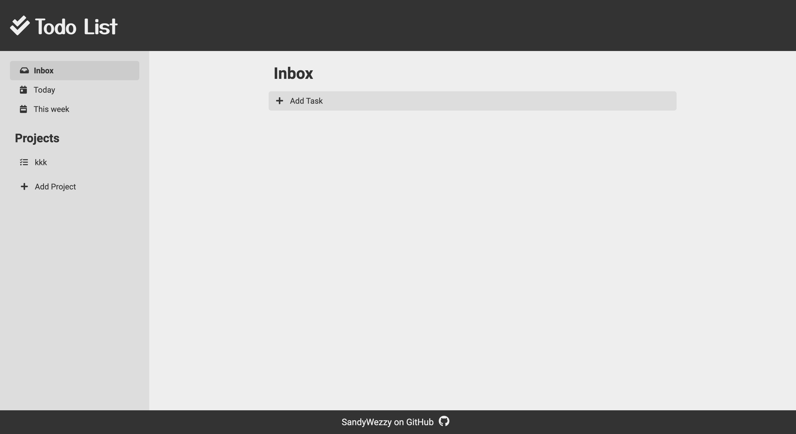

# ToDo List

## This is a simple restaurant website for me as a training working with webpack.

## Built With 

- Vanilla JS
- HTML5
- CSS3

## Live Demo

[ToDo List:]https://SandroCristino.github.io/toDo_list/

## Getting Started

In order to setup and work on this project on your own, you will need to:

1. Clone this project:  
git@github.com:SandyWezzy/toDo_list.git

2. Once you have cloned this project, you can install the required dependencies by using:  
`npm install`

3. A live demo of the project can be started by using:  
`npm start`

4. Distribution files can be produced using:  
`npm run build`

### Usage

#### So here you are able to create projects and add them toDo's

##### There are three buttons on the left
- **Inbox**.- Shows your inbox tasks
- **Today/ Week**.- Shows your tasks either dated today or this week

## 🤝 Contributing

Contributions, issues, and feature requests are welcome!

## Show your support

If you got until here, show your love hitting the ⭐️ button, I'd really appreciate it.
